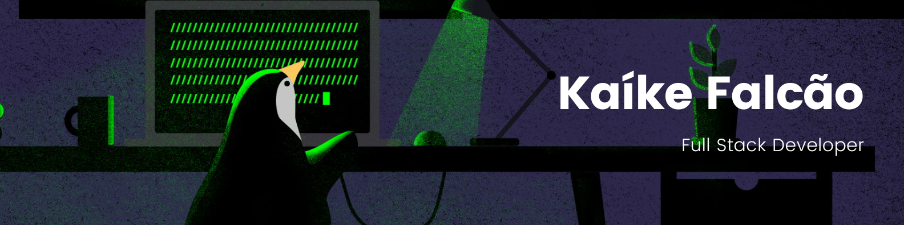

# 👋 Hi there

I'm Kaíke Falcão, a passionate software developer and tech enthusiast with a keen interest in exploring different programming languages and technologies. Currently, I work as a Full Stack Software Developer at [Conexa](https://conexa.app/).

Detailed Information: 
Age: 20 
I've worked with: Laravel, Yii, Vue.js 
Studying and building personal projects with: Javascript, Elixir, React.js

> “Sometimes even to live is an act of courage.” — Seneca

# Socials

# My Techs & Tools

# 📊 GitHub Stats:

---

